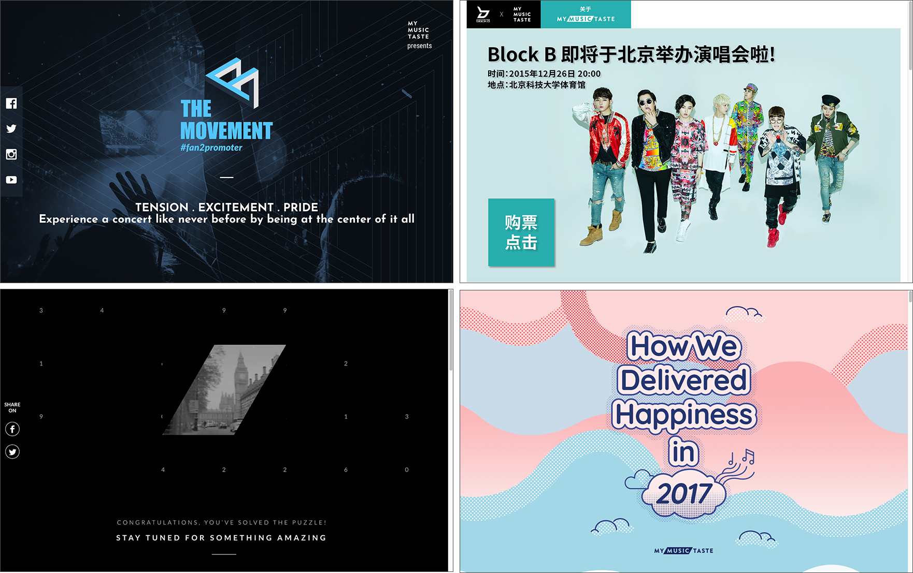
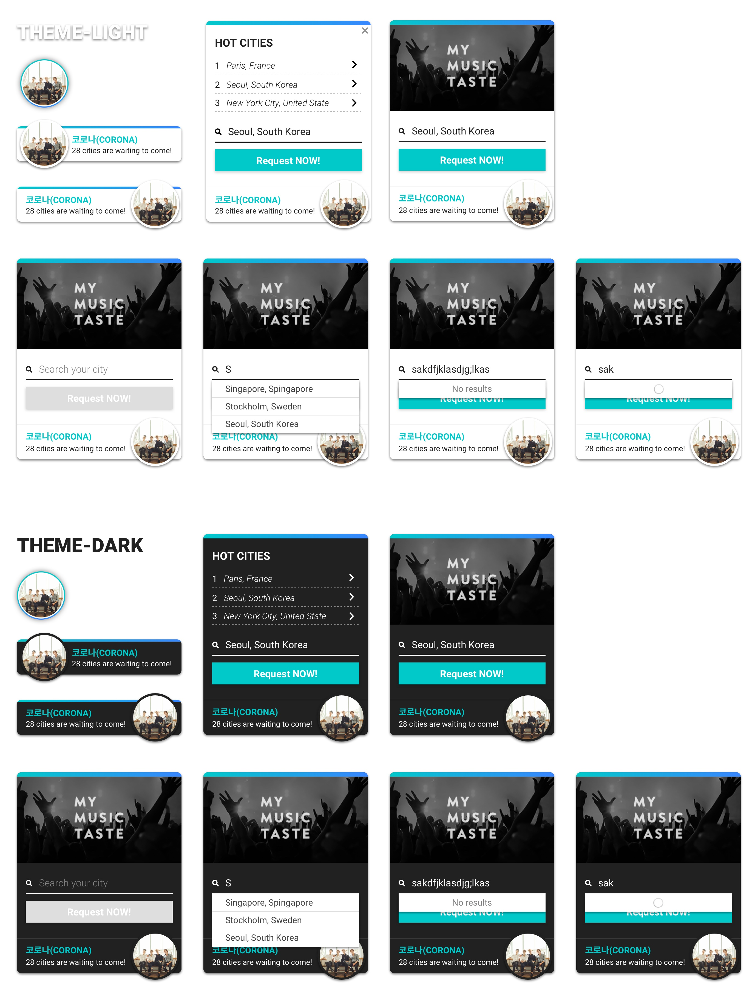

# 2015.06~ing
저의 경력은 2015년 6월을 기점으로 크게 나뉩니다. 경력의 대부분을 차지하는 2015년 6월 이후의 작업물들에 대해 자세하게 기술해 놓았습니다. 마크업 코드는 보안상의 이유로 모두 공개할 수는 없으나, 현재 서비스 되고 있는 페이지들을 통해서 확인 하실 수 있습니다. 저와 작업에 관련된 질문들은 ohj4508@gmail.com이나 [블로그](http://zinee-world.tistory.com/guestbook)로 보내주시면 성심껏 답변해 드리겠습니다.

 

## MyMusicTaste / UI developer

### 1. [메인 서비스 v2](http://mymusictaste.com) 마크업
2015년 6월부터 서비스 전체 리뉴얼에 참여하여 마크업을 전담했고, 2016년 3월에 릴리즈 하였습니다. 그 후 현재까지 새 피쳐 추가 및 유지보수를 담당하고 있습니다.
* 웹/모바일웹 마크업 전담, v2 릴리즈(2015.07~2016.03)
* 새 피쳐 마크업 전담 및 유지보수 (2016.03~ing)

 

### 2. [팀 사이트](http://team.mymusictaste.com) 개발 및 유지보수
* [2015.07] v1 - MMT 첫번째 팀 사이트 제작
	* 반응형, 부트스트랩 기반, IE9+ 및 모던브라우저 호환
* [2016.08] v2 - 디자인 업데이트 및 코드 리팩토링
	* 반응형, `backbone.js`, 멤버 정보 & 콘서트 히스토리 API로 가져와서 업데이트 되도록 수정
* [2017.05] v3 - 전체 리뉴얼 및 프레임워크 변경 (기획 참여)
	* 반응형, `vue.js`, gallery, google map

 

### 3. 마이크로 사이트 개발
서비스와 관련된 프로젝트 사이트, 콘서트 티저 및 MD 판매 사이트 등 다양한 마이크로 사이트를 반응형으로 빠르게 제작합니다.
* [2015.08] [The Movement](http://movement.mymusictaste.com/)
* [2015.10] [Block B China Teaser Site](http://code.mymusictaste.com/blockb/dev2.html)
* [2015.11] [EXO Teaser Site](http://code.mymusictaste.com/exo)
* [2016.07] Astro, Monsta X, Seventeen MD Site 
* [2017.12] [MMT Year in Review 2017](http://2017.mymusictaste.com) (CSS 인터랙션 기획/개발)

 

### 4. 기타
다양한 플랫폼/디바이스 호환이 가능한 서비스 내부 발송용 이메일 템플릿 마크업, 사내 세미나 진행 및 내부 툴 기획/디자인/개발 다양한 업무를 병행합니다.
* [2016.06] Direct Mail Markup (Gmail, Outlook, Hotmail, Yahoo 호환)
* [2016.09] Email Edit Tool 기획/디자인/개발 [[회고]](http://zinee-world.tistory.com/395)
* [2017.01] 비개발자를 위한 8주간의 HTML/CSS 수업 [[회고]](http://zinee-world.tistory.com/456?category=614533) 
* [2017.04] 내부 운영 툴 개선 작업 (프로젝트 문서관리, 기획, 와이어프레임, 디자인, 마크업)
* [2017.06] [MMT 테크 블로그](http://mymusictaste.github.io) Jekyll Theme 수정
* [2017.07] [MMT Widget](https://codepen.io/zineeworld/full/BJRXLp/) 기획/디자인/마크업

 
 

## Pet Project
* [2016.11] [CSS로 라이언 그리기 튜토리얼 제작](http://zinee-world.tistory.com/category/CSS%20Drawing/Tutorial)
* [2016.11] [Python Scrapy로 디씨인사이드 갤러리 크롤러 제작](http://zinee-world.tistory.com/408?category=614533)
