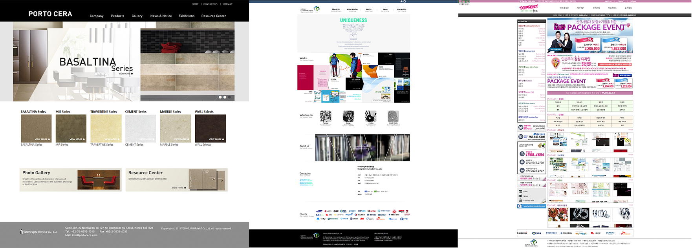

# 2014.02~2015.06
## JC Planet / Web Publisher
저의 경력이 시작된 시점입니다. 마크업 작업 기여도는 모두 100%이고, 약간의 디자인을 함께했습니다. 국내 게임들을 해외로 퍼블리싱 하는 회사여서 게임 사이트들의 CBT, OBT, 오피셜 사이트 및 이벤트 페이지 마크업을 주로 담당했습니다. 게임 자체가 PC 게임이어서 모바일로 웹 사이트에 접속하는 것이 큰 의미가 없어서 주로 데스크톱 웹 사이트를 위주로 작업했습니다. 회사에 디자이너가 없었던 상황이어서, 게임 운영에 필요한 이벤트 배너 등을 함께 제작하기도 했습니다.

 

### 1. 포탈 사이트 마크업
* [웹 사이트](http://jcplanet.com) 리뉴얼 마크업 전담 (2014.02~2015.06)
  * Main, My Planet, JC Coin, Support, Account(Login/Sign Up)
* [모바일 웹 사이트](http://m.jcplanet.com) 기획/디자인/마크업 전담 (2015.03~2015.05)

 

### 2. 자사 퍼블리싱 게임 사이트 마크업
* [2014.02] [Legend of Silkraod](http://zinee91.dothome.co.kr/portfolio/LOS-CBT) CBT 사이트 마크업
* [2014.03] [Legend of Silkroad](http://zinee91.dothome.co.kr/portfolio/LOS-Official/docs/main/index.html) 공식 사이트 마크업
* [2014.08] [Legend of Edda](http://edda.jcplanet.com) 공식 사이트 마크업
* [2015.03] [Metal Reaper](http://zinee91.dothome.co.kr/portfolio/MR/docs/main/index.html) 공식 사이트 마크업
* [2015.05] Metal Reaper 랜딩 페이지 디자인/마크업

 

### 3. 이벤트 페이지 및 미니게임 사이트
* [2014.12] 크리스마스 이벤트 페이지 디자인/마크업
* [2015.02] [미니 게임사이트](http://mini.jcplanet.com) 기획/디자인/마크업

 
 

## 2013.10~2013.11
### Design Communication / (Intern) Web Publisher
* 기업 사이트 메인 페이지 리뉴얼 마크업 전담
* 투프린트(서비스 사이트) 부분 리뉴얼 마크업 전담
* Portocera 마크업 전담

